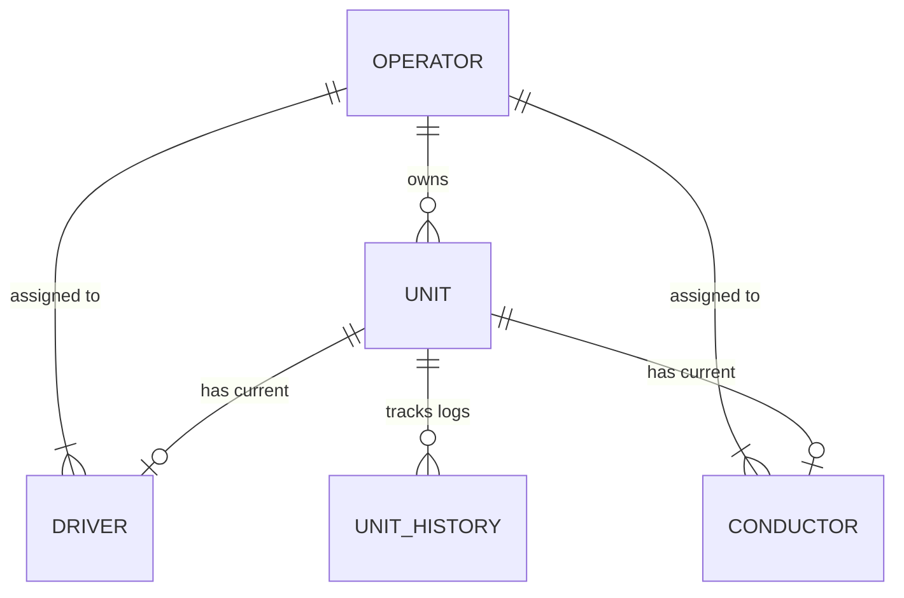

# PUV Profiling Management System - Comprehensive User Manual

Welcome to the **PUV (Public Utility Vehicle) Profiling Management System User Manual**. This document provides detailed, step-by-step instructions and technical explanations of the system's features, workflows, and administrative functions.

---

## Table of Contents
1. [System Overview & Architecture](#1-system-overview--architecture)
2. [Getting Started & Authentication](#2-getting-started--authentication)
3. [User Roles & Security Permissions](#3-user-roles--security-permissions)
4. [Dashboard & Quick Monitoring](#4-dashboard--quick-monitoring)
5. [Operator Fleet Management](#5-operator-fleet-management)
6. [Driver Profile Management](#6-driver-profile-management)
7. [Conductor Tracking](#7-conductor-tracking)
8. [Unit Monitoring & Assignment History](#8-unit-monitoring--assignment-history)
9. [Bulk Data Import & Exports](#9-bulk-data-import--exports)
10. [Audit Logging & Security Controls](#10-audit-logging--security-controls)
11. [Auto-Generation Rules & Patterns](#11-auto-generation-rules--patterns)
12. [Troubleshooting & FAQs](#12-troubleshooting--faqs)

---

## 1. System Overview & Architecture

The **PUV Profiling Management System** is a centralized, role-based platform designed to manage and monitor public utility vehicles, operators, drivers, and conductors. It serves as a modern tool for transport management departments (such as the CPDO) to maintain clean, searchable records of PUV operations.

### System Data Model Relationships

- **Operator**: The franchise/business owner who holds ownership over one or more PUV units.
- **Unit**: A registered public utility vehicle (Tricycle, Jeepney, or Mini Bus) with dedicated specifications, including its Body Number, Plate Number, and Zone.
- **Driver**: The active driver operating a vehicle unit under a specific operator.
- **Conductor**: The staff helper assigned to a unit (primarily for Mini Buses).
- **Unit History**: Auto-generated transaction ledger tracking all modifications, driver transfers, and assignments for units.

---

## 2. Getting Started & Authentication

### System Requirements
- **Web Browser**: Google Chrome (v100+), Mozilla Firefox (v100+), Safari (v15+), or Microsoft Edge (v100+).
- **Network**: Active Internet connection to communicate with the application APIs and media cloud hosting.
- **Display**: Responsive design optimized for desktops, tablets, and mobile devices (minimum width: 360px).

### Accessing the Portal
1. Open your browser and navigate to the application URL.
2. The login screen displays with official organization logos (CPDO & Operator Services).
3. Input your registered **Email Address** and **Password**.
4. Use the **Show/Hide Password (eye icon)** to preview your typed password.
5. **Remember Me**: Check this box if you are on a personal, secured computer. This keeps you signed in by storing credentials locally. Uncheck on shared/public machines.
6. Click **Sign In**.

> [!WARNING]
> Multiple invalid login attempts may require an administrator to reset your account. Keep your credentials private.

---

## 3. User Roles & Security Permissions

The application implements a strict **Role-Based Access Control (RBAC)** model to safeguard transportation data.

| System Function | Admin Role | OTMPS Role |
| :--- | :---: | :---: |
| View Dashboard Statistics | ✅ | ✅ |
| View Directories (Drivers/Operators/Conductors) | ✅ | ✅ |
| View Unit History Timeline | ✅ | ✅ |
| Create/Edit/Delete Records | ✅ | ❌ (Blocked) |
| Import Master CSV Templates | ✅ | ❌ (Blocked) |
| Export Data to Excel Sheets | ✅ | ❌ (Blocked) |
| Upload & Replace Profile Images | ✅ | ❌ (Blocked) |
| View System Audit Logs | ✅ | ❌ (No Access) |

- **Admin**: Full read, write, update, delete, and import permissions. Access to core audit trails.
- **OTMPS**: View-only capabilities. Useful for inspection, searching, and desk queries.

---

## 4. Dashboard & Quick Monitoring

Upon signing in, you are greeted with the **Dashboard**, offering a real-time statistical snapshot of the transportation network.

### Dashboard Key Elements
1. **Quick Statistics Cards**:
   - **Total Registered Drivers**: Total active driver records.
   - **Total Operators**: Total unique business owners.
   - **Total Conductors**: Total active conductor profiles.
   - **Total PUV Units**: The sum of all active vehicles.
2. **Category Cards**: Breakdown of the active transport fleet:
   - **Tricycle**: Displays tricycle driver count and unit count.
   - **Jeepney**: Displays jeepney driver count and unit count.
   - **Mini Bus**: Displays mini bus driver count, unit count, and conductor count.
   - *Tip: Clicking any of these cards navigates to the directory pre-filtered for that vehicle type.*
3. **Recently Added Items**: Lists the 5 most recent additions for **Drivers**, **Operators**, and **Conductors** to quickly inspect recently logged entries.
4. **Master CSV Import Box** (Admin Only): Allows bulk loading of spreadsheet files.

---

## 5. Operator Fleet Management

The **Operators Directory** handles operator business details and registers the associated vehicle fleets.

### Viewing Operator Details
- Navigate to **Operators** using the sidebar.
- Use the search bar to filter by operator name, contact number, or address.
- Click an operator row to slide open the **Details Panel**:
  - Displays personal/business info.
  - Lists all **Associated Units** owned by this operator.
  - For each unit, shows its active Driver, Conductor (if assigned), plate number, zone, and category.

### Actions (Admin Only)
- **Add Operator**: Click the button in the top right. Fill in Name, Civil Status, Birth Date (the system auto-computes the age), Contact Info, Type (default is "FOR HIRE"), and upload a Profile Photo.
- **Edit Operator**: Modify info or upload/replace the profile photo.
- **Delete Operator**:
  > [!CAUTION]
  > Deleting an operator performs a **cascade delete**. This will permanently remove the operator, all their registered vehicle units, assigned drivers, assigned conductors, and the history timeline for those units. This action is irreversible!
- **Add Unit to Operator**: Inside the operator details panel, click **Add Unit** to attach a new vehicle.

---

## 6. Driver Profile Management

The **Drivers Directory** allows searching, tracking, and editing of individual driver personnel.

### Search and Filters
- **Smart Search**: Search by name, CPDO ID, license number, plate number, or body number.
- **Zone Dropdown**: Filter drivers by their operating zones (e.g., Zone 1-9, BB, J01-J13, OB, OZ).
- **Pagination**: Results are paginated with 8 items per page for optimized performance.

### Adding & Editing Drivers (Admin Only)
1. Click **Add Driver** or click **Edit** on an existing driver's details card.
2. Fields include:
   - **CPDO ID** & **License Number**: *Both are unique identifiers and cannot be duplicated in the database.*
   - **License Expiry Date**: Tracked for regulatory enforcement.
   - **Personal Info**: Full name, birthdate (month, day, year), birthplace, contact number, and civil status.
   - **Address details**: House No, Street, Purok, Barangay, City.
   - **Assignments**: Choose the Operator and Unit for the driver.
3. Click **Save** to apply.

---

## 7. Conductor Tracking

Conductor management tracks helpers assigned to PUV routes, which is common in Mini Bus fleets.

- Access **Conductors** from the sidebar.
- Conductors are linked to an Operator and a Unit.
- Detail profiles include personal data, contact information, profile photos, and **Emergency Contact details** (Emergency Name, Number, and Address).
- Admins can create, edit, or delete conductor profiles similarly to drivers.

---

## 8. Unit Monitoring & Assignment History

The **Unit History** dashboard is one of the system's most powerful monitoring features. It tracks vehicle units over time, maintaining a complete log of assignments, transfers, and driver histories.

### Driver & Conductor Assignment Sync Logic
To prevent data misalignment, the system uses synchronized assignment logic:
- When a Driver is assigned to a Unit, the system:
  1. Removes that driver from any other unit they were previously assigned to.
  2. Updates the Driver's profile record to link to the new unit and operator.
  3. Records a `startDate` in the Unit's internal `driverHistory` tracking array.
- When a Driver is reassigned or removed from a Unit:
  1. The system updates the `driverHistory` log entry for that driver, setting the `endDate` to the current date/time.
  2. Clears the unit/operator references on the old driver's profile.
- The exact same rules apply when assigning or replacing Conductors.

### Unit History Records
Whenever a unit is modified (updated plate number, transfer of ownership, or change of category), an entry is appended to the **Unit History** database ledger with:
- **Change Type**: `Creation`, `Update`, `Transfer`, or `Status Change`.
- **Change Summary**: Automatically generates a list of fields that changed (e.g. *"Operator, Driver Updated"* or *"Plate No Updated"*).
- **Old Data & New Data**: Snapshots of the database before and after the modification.
- **Author**: The logged-in admin email who performed the action.

---

## 9. Bulk Data Import & Exports

### CSV Master Data Import (Admin Only)
To migrate data from legacy files, Admins can perform bulk imports:

1. Click **Download Template** on the Dashboard.
2. Fill out the CSV template exactly as formatted. Keep the headers in order (57 columns total, covering Operator, Unit, Driver, and Conductor).
3. Click **Import Data** and select your file.
4. The system will process each row:
   - Finds or creates operators by full name.
   - Creates or updates units by operator and body number.
   - Creates/assigns drivers and conductors using their names and IDs.
   - Parse dates: Supports both standard ISO dates (`YYYY-MM-DD`) and Excel serial numbers.
   - Automatically computes zones and color codes if they are left blank.
5. On completion, a **Success Modal** displays the statistics of imported operators, units, drivers, and conductors.

### Data Exports
On the Driver, Operator, and Conductor directories, click **Export Excel** to save the currently searched/filtered list to a formatted Excel file.
- The exported sheet automatically aggregates all relational details (e.g. driver sheets will include operator details, unit plates, motor/chassis numbers, and update stamps).
- Export filenames include active filter parameters and a clean timestamp.

---

## 10. Audit Logging & Security Controls

All write operations are logged in a tamper-resistant **Audit Log** accessible only to administrators.

### Log Attributes
- **Timestamp**: Exact date and time of the event.
- **User**: The email address of the administrator who triggered the event.
- **Module**: The affected data collection (`Driver`, `Operator`, `Conductor`, `Unit`).
- **Action**: `Create`, `Update`, or `Delete`.
- **Summary**: A human-readable description of the change (e.g., *"Imported/Updated operator JUAN DELA CRUZ with 2 units"*).
- **Data Delta**: Before and after JSON snapshots are recorded to trace precise field changes.

---

## 11. Auto-Generation Rules & Patterns

To speed up data entry, the system automatically fills out **Zones** and **Color Codes** based on the entered **Body Number** and **Vehicle Category**.

### 11.1 Tricycles
- **Zone Formula**:
  - Body numbers starting with `BB` are assigned to **Zone BB** (Bypass/Boundary).
  - Body numbers starting with digits `1` to `9` are assigned to **Zone 1** through **Zone 9** respectively.
- **Color Codes**:
  - `1...` → **ORANGE**
  - `2...` → **GREEN**
  - `3...` → **BLUE**
  - `4...` → **BROWN**
  - `BB...` → **SILVER**
  - `5...` → **CREAM**
  - `6...` → **YELLOW**
  - `7...` → **RED**
  - `8...` → **SKYBLUE W/ CREAM TOP**
  - `9...` → **SKY BLUE W/RED TOP**

### 11.2 Jeepneys
- **Zone Formula**: Body numbers starting with `J01` through `J13` are assigned to zones **J01** through **J13**.
- **Color Codes**:
  - `J01...` → **YELLOW**
  - `J02...` → **ORANGE**
  - `J03...` → **RED**
  - `J04...` → **YELLOW GREEN**
  - `J05...` → **CREAM**
  - `J06...` → **BROWN**
  - `J07...` → **GREEN W/WHITE TOP**
  - `J08...` → **DARKBLUE**
  - `J09...` → **SKYBLUE**
  - `J10` / `J11` → **YELLOW W/RED TOP**
  - `J12` / `J13` → **SKYBLUE W/GOLD TOP**

### 11.3 Mini Buses
- **Zone Formula**:
  - Body numbers starting with `OB` or `O-B` → **Zone OB**.
  - Body numbers starting with `OZ` or `O-Z` → **Zone OZ**.
- **Color Codes**:
  - `OB` / `O-B` → **DIRTY WHITE WITH GREEN STRIPES**
  - `OZ` / `O-Z` → **WHITE WITH BLUE STRIPES**

---

## 12. Troubleshooting & FAQs

### Q: Why does my CSV import fail?
- **Missing Required Columns**: Ensure the first row of your CSV contains all 57 columns from the template.
- **Duplicate CPDO ID or License Number**: Ensure driver CPDO IDs and License Numbers in the spreadsheet are unique and do not conflict with existing records.
- **Format Errors**: Verify the file is saved as a `.csv` or `.xlsx` file, and columns aren't merged.

### Q: Why can't I see the "Import Data" or "Export Excel" buttons?
- Your active session is logged in as an **OTMPS** user. OTMPS users have read-only access. Ask an Administrator to check your account privileges if you require write access.

### Q: Why is a driver's age displayed incorrectly?
- The driver's age is calculated dynamically based on the **Birth Month**, **Birth Date**, and **Birth Year** fields. Verify these date fields are entered correctly in the form.

### Q: How do I change a driver's assigned vehicle?
1. Go to **Unit History** or **Operators** page.
2. Select the vehicle unit you want to reassign.
3. Click **Edit Unit** or edit the unit details.
4. Select the new driver from the dropdown. The system automatically handles unlinking their old vehicle and records the new assignment dates.

### Q: What should I do if the photo upload fails?
- Ensure the image file size is under **5MB**.
- Ensure the file is in a supported format: `.jpg`, `.jpeg`, `.png`, `.webp`, or `.gif`.
- Verify your server has internet access to communicate with the Cloudinary storage provider.

---
*PUV Profiling Management System User Manual - Version 1.0 (Updated June 2026)*
